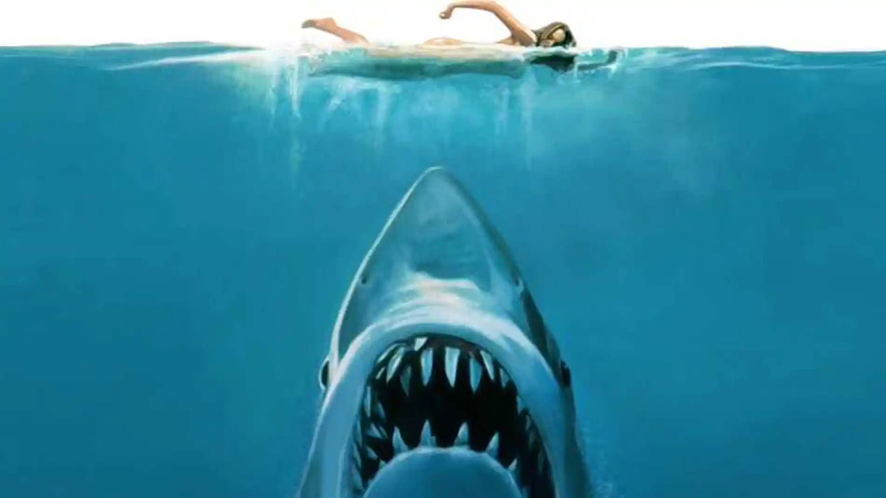

<<<<<<< HEAD
# Sharks Project

=======
# USS INDIANAPOLIS

>>>>>>> b586de47702f9c2ccfe5104994a3253138160d16
# Objetivo:

La finalidad del ejercicio es poder poner en práctica todo lo aprendido sobre exploración, limpieza, análisis y visualización de datos.

# Hipótesis:

1. Los ataques de tiburón son menos mortales a hombres que a mujeres.
<<<<<<< HEAD
2. Los ataques mortales a hombres de entre 20 y 30 años son menos letales que a los que están entre los 40 y 60 años.
=======
2. Los ataques mortales a hombres de entre 20 y 30 años son menos letales que a los que están entre los 40 y 60 años.
>>>>>>> b586de47702f9c2ccfe5104994a3253138160d16
